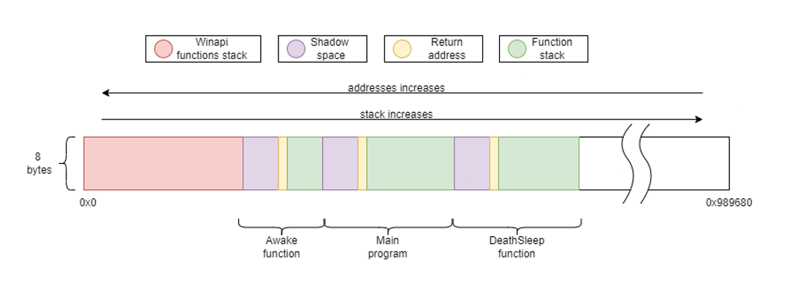
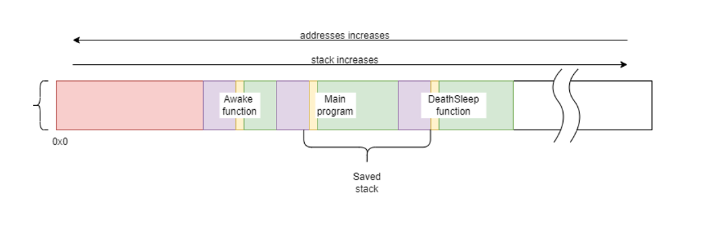
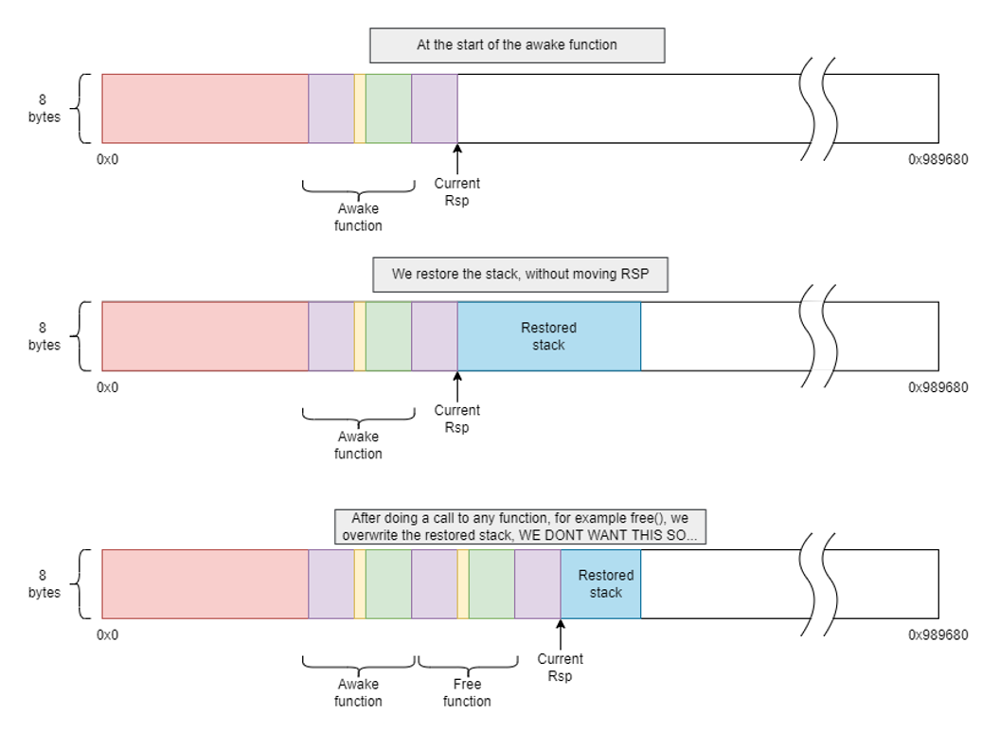
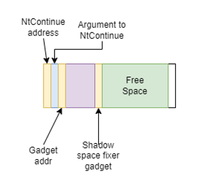

        ██████╗ ███████╗ █████╗ ████████╗██╗  ██╗███████╗██╗     ███████╗███████╗██████╗ 
        ██╔══██╗██╔════╝██╔══██╗╚══██╔══╝██║  ██║██╔════╝██║     ██╔════╝██╔════╝██╔══██╗
        ██║  ██║█████╗  ███████║   ██║   ███████║███████╗██║     █████╗  █████╗  ██████╔╝
        ██║  ██║██╔══╝  ██╔══██║   ██║   ██╔══██║╚════██║██║     ██╔══╝  ██╔══╝  ██╔═══╝ 
        ██████╔╝███████╗██║  ██║   ██║   ██║  ██║███████║███████╗███████╗███████╗██║     
        ╚═════╝ ╚══════╝╚═╝  ╚═╝   ╚═╝   ╚═╝  ╚═╝╚══════╝╚══════╝╚══════╝╚══════╝╚═╝     
                                                                                 

A POC to demonstrate the possibility of killing the current thread and restoring it before resuming execution by an agent, while implementing page protection changes during no execution.

## Intro

Sleep and obfuscation methods are techniques that are already widely spread in the maldev community, with different implementations, with the objective of hiding from memory scanners while sleeping, usually changing page protections and even adding cool features like encrypting the shellcode, but there is another important point to hide our shellcode, and is hiding the current execution thread, that mainly involves spoofing the thread stack. 
Spoofing the stack is cool, but after thinking a little about it I thought that there is no need to spoof the stack… if there is no stack :)

The usability of this technique is left to the reader to assess, but in any case, I think it is a cool way to review some topics, and learn some maldev for those who, like me, are starting in this world.

The main implementation showed here holds everything that we need to take out of the stack in the data section, as global variables, but an impletementation moving everything to the heap is showed in this branch. It aims to show some key modifications that needs to be done to make this code pic and injectable. 

---

 Whats going on? 

## Basics

The main objective of this technique is clear, terminating the current thread and restoring it before resuming execution, but what exactly does this mean, and which new constraints it puts in place?

To be able to restore the execution, we need to save two things before terminating the thread, first, the CPU state, and secondly the stack, and effectively set them up again after the new thread is launched.

I talked about new constraints that will appear in this techniche, and there are two big ones: First we need to store outside the stack anything that is needed from the moment the thread terminates until the stack is restored, and as you will see, it creates some new challenges.

Second, we always need at least another thread running in our process, since we are terminating our thread, if there are no other threads the process will end. I don't think this a big problem, since most agents are injected in other processes, we can assume that this process will keep at least one thread running.

## DeathSleep components:

We can view on this POC 4 core functions:
* **Main program:** This is where you would write your agent code, and it's the portion of the code that will make use of DeathSleep
* **Awake function:** this is the entry point of all our threads, and it's in charge of saving the starting point of the stack that we will be restoring. Also, it's in charge of restoring the stack and CPU context when it's needed, or just launching our main program.
* **DeathSleep:** this is the main function of this technique, and is in charge of backing up the thread context and stack, and also setting everything up for the magic to happen.
* **Rebirth:** A simple function only in charge of launching our new threads.

## Saving the stack.

When we are about to save the stack, a question is raised: how much of the stack needs to be saved?

Lets review first what is in the stack after we called the DeathSleep function (this is the function that saves the context, stack and prepares everything for the obfuscation and restoration)

  
As we can see, every function has three parts:

* **Shadow space:** this is a 32 bytes space, allocated by the caller, but used by the callee. As far as I know and I could see, its main function is to hold, if needed, the arguments passed to the callee function in registers, but it can be used for anything the callee function decides.
* **Return address:** this is the address of the next instruction to be executed in the caller function, pushed by the CALL instruction, so the RET instruction in the callee will just take this address and “jump” to it when it ends.
* **Function stack space:** This is the space reserved by the callee to store the value of registers that need to be restored and the value of its local variables.

The minimum portion of the stack that we obviously need to save is everything inside our main program, that means its shadow space, its return address and everything until the DeathSleep function.
Anything before that is not really required (saving the stack used by the entry function has its advantages, but we will discuss that later), as that is the stack used by windows routines for launching our new thread.
Apart from this, I decided to also store the shadow space of the DeathSleep function (not really needed, but it makes the calculation of the Rsp at the moment of waking up easier).

So at the end, we are saving this:
  

## How to find our stack addresses:

Every function on a standart compilation should be composed of 3 parts, the prologue, the function code, and the epilogue.

The Rsp (stack pointer), should only be modified on the function prologue and epilogue. The prologue increases the stack pointer (remember increasing the stack means reducing addresses, since they go in opposite directions), to save registers, to hold all its local variables and then to hold the shadow space, and the epilogue does exactly the opposite.

This means that the stack pointer inside the function code should always point to the end of the shadow space (purple on the above image), and the sum of the stack size of the function and the shadow space can be found by calculating how much the prologue increases the stack pointer. This value can be easily calculated using the information held in the unwind tables, an explanation about their usage is something we will not cover here, but as a summary, those tables are used to allow any other thread or process to correctly move through the stack to see its content, to handle exceptions or to analyze it.

## Capturing and preparing the context to restore.

Capturing the context is probably one of the easiest things to do, as we can simply do RtlCaptureContext() at the first line of DeathSleep, before any modification is done to the non-volatile registers.
We still need to do two modifications to the context where we will restore the execution.

The first one will be modifying its Rip, as you remember, this is the register that holds the next instruction to run, and if we just leave this unmodified, execution will resume inside the DeathSleep function. What we will be doing is changing the Rip to hold the return address of DeathSleep, which is pointed by the current Rsp displaced the size increased in the epilogue (green + purple areas in the images above).

The second modification will be done when the thread is restored, and it implies setting the Rsp to point to the top of our restored stack; this will be done during the restoration phase, since we don't know where our new stack will be placed. The value will simply be the end address of our restored stack, since as we discussed later, we copied also the shadow space reserved by the caller of DeathSleep, and that's exactly the value of RSP before the call to DeathSleep.

## Restoring our stack:

Once we reach the point of waking up, just before resuming execution, we need to put our saved stack in place. 
As we already know our saved stack starts at the address captured by the awake function, so the new captured address will be the starting point where we will be placing our saved stack, but this raises a problem, any call to a function after we placed our old stack would modify it and break it, and doing the cleanup here is really convenient, specially freeing the heap used to hold our stack backup.
This means that we need to move our current Rsp and also the parts of the stack that we are currently using to a place outside where we will place our restored stack. 
Trying to make it clearer here is the problem:
  

  
And here is my solution, just move everything away:
  

  
## Restoring the context:

  After we did all the hard work, the last thing to do is using NtContinue, this function allows us to change the current context with our previously captured and modified context, setting the RIP right after the call to DeathSleep, all the register should have the same values as they had when calling DeathSleep, and RSP should be pointing at the top of the stack.

## Scheduling the restoration process: Using thread pool API.

Okay, we know the basics of what we need to do to store and restore the current thread, but we need somehow be able to run all of this even when we have no threads.
Here is where we meet our lovely Thread Pool API, a tool given by Windows, that will allow us to queue tasks (functions with one argument max) to a group of threads (a pool) that will be fully managed by the operating system.
If you have seen Ekko, you can see that it uses this API, so… let's implement it the same way.

Everything worked fine, but there was one problem, a worker was still up even after ending the execution of its queued tasks. This was a problem, since I wanted to destroy all the threads our program could generate, so this was not the way to go. 

After digging a little, I discovered that the thread pool API, used in Ekko, was an old version, and there was a new one with some more capabilities, and, between them, a function that will effectively solve our problem: CloseThreadPool(). This new API allows us to create our own pool, and destroy them after using them, terminating all the used workers. It gives another two advantages: setting a maximum number of threads and cleaning groups.
Setting a maximum number of threads would allow us to execute all our tasks sequentially, as long as they are queued with any time difference. 
The cleaning groups are useful to make the cleanup easier after everything is done.

So… it's everything done? Well, at this point the thread is terminated, and we are queuing the rebirth function which creates the new thread with awake as its entry point, restores the previous state  and closes the pool, so far so good!

## Changing memory permissions, redirecting execution.

When I ended with everything that we discussed before, I thought the hard part was solved, since this part was already solved by previous techniques, but ooh boi, I didn't know what was coming.

The main problem is that we need to offload it outside of our code, since we are changing the memory protection to RW (read-write), if we call VirtualProtect(), when the function returns, our process will crash (we can't execute instructions in RW pages), so we need to find a way to execute this from somewhere else, and make it return also to some RX(read-execute) pages (and the same thing happens when coming back).
Obviously, we will be using the thread pool API for this too, but there is a problem, we can only give one argument to our tasks, and VirtualProtect() takes 4.

For this we will be using NtContinue() again, the first time I saw this use for this function was on [Foliage](https://github.com/SecIdiot/FOLIAGE), but it is also used in [Ekko](https://github.com/Cracked5pider/Ekko). 
NtContinue(), as we saw before, allows us to set some context to the thread that calls it, and with some clever tweaking, it can “call” a function with multiple arguments, by using only one (very convenient for the thread pool API). 
The main idea is to set the RIP to the start address of the function, and, since the windows x64 calling convention passes the first four arguments in registers (rcx, rdx, r8, r9, in that order), just put your arguments on the context structure you will pass to NtContinue and, and it will effectively simulate a call to a function.
The last thing we have to take care when using NtContinue is the Rsp, since, as we saw before, this address should hold the return address when a function is called.

So the first thing we need for NtContinue to work is to get a context, we could craft it manually, but we would find a problem, finding the value for Rsp, that when passed to our function, will point to the address that will be used by RET to return. 
Our tasks will work in a different thread, so we don't know where its stack will be placed.
The solution (carefully stolen from [Ekko](https://github.com/Cracked5pider/Ekko), thank you very much :P) is taking a copy of the context inside a worker with RtlCaptureContext(), and increase the stack pointer of the context obtained by 8, so it will point to the address introduced in the stack by CALL RtlCaptureContext(), and which is the return address of this last function, and we can use it as the return address of all our functions.

Okay this is nice, but what happens when we can not do this modification to the Rsp?
That's what happens when we deobfuscate, we will be in a new thread, so the old context's Rsp is useless. We need a new context, taken from the new thread, but we can't use the old trick of modifying the Rsp to point to the correct address.

## Rop Chains

So we can not modify the context obtained, but that doesn't mean it is useless, in reality we will be using it, but in a different way. If we just restore that context with NtContinue(), without modifying its Rip, it will just redirect the execution to the next instruction after the call to RtlCaptureContext(), and with a correct Rsp, so we can use it after our calls to NtContinue() with modified contexts, to be able to correctly end the execution of our tasks.
For doing this we will be using a Rop chain, by setting the Rsp of our first context to point to a manually crafted stack, that will hold everything we need to redirect execution until the second NtContinue() call that will set the correct context to end.

This is how our crafted stack should look like:
  
 

We are making use of 2 rop gadgets, one for fixing or “jumping” over the shadow space of our function, and the second one is in charge of placing the argument for NtContinue in rcx, and then returning to it.

Finding this 2 rop gadget is quite easy, the one for fixing the shadow space is just the epilogue of almost any function (i found more than 500 hits only in Ntdll), since as we saw before, epilogues are designed mainly to reduce the Rsp, and the second one is just a pop rcx; ret; which is 2 bytes, and also found a couple ones between Ntdll and Kernel32 dlls.

## A little reversing to the thread pool Api

As we saw, using NtContinue only needs to have its first argument filled to work, and this is perfect with the old thread pool API, but in the new thread pool API, the arguments are passed in the second position, so yeah, this alone wont work.

After some hours without knowing how to solve this last problem, it came to my mind that both apis used the same functions in some cases, and that made me think that they could be more similar than they could appear, so I decided to investigate what were the relation between them.

For the old api we are using CreateTimerQueueTimer() to queue our tasks, and in the new one, we need two functions to do the same:
CreateThreadpoolTimer(), that will take the callback function and the argument to pass to it, and will return a pointer to a  TP_TIMER structure that describes the task, and a second function to queue the task: 
SetThreadpoolTimer(), that will take the previous pointer and a pointer FILETIME structure that describes when the task will be executed.

If we reverse this functions, we will find this: 

  
  

So as we can see CreateThreadpoolTimer() is just a fancy wrapper for TpAllocTimer(), and SetThreadpoolTimer() is just a forwarder to TpSetTimer().

Now let's check the insides of CreateTimerQueueTimer().
At first, it is just another fancy wrapper to a function in Ntdll, RtlCreateTimer(), and here is where the magic happens. This is a bigger function but here is the gold that we were looking at:

  
  
As you can see, inside this function there is effectively a call to TpAllocTimer() and to TpSetTimer(), which is similar to saying that it is calling CreateThreadpoolTimer() and SetThreadpoolTimer() inside it. As we can see the function that we are queuing is not directly the callback we have given to the function, it is setting RtlpTpTimerCallback() as the callback. 
If you didn't realize yet what all of this means, is that we are using CreateThreadpoolTimer() to queue a function that receives its arguments in the second position, RtlpTpTimerCallback(), that will execute another function with its arguments in the first position.

So the only thing that we still need to understand is how the callback information is passed to RtlpTpTimerCallback(), and after some reversing I ended with the following structure, that surprise surprise, IT WORKS!

  
  
Now we can call functions that receive their arguments in the first position and at the same time we are able to close our pools, and leave no threads running, win win.
Is important to note that this function is not exported in Ntdll, so I decided to find it by its byte form inside the dll.

So this is the end, and with everything reviewed, I think I gave the core ideas that came throw my mind while developing this POC, and why everything was done in the way I did it.

## Wish you have enjoyed :)

  

  
---

 Testing considerations 

  
  This code was tested only with MSCV compiler and linker, since this POC is heavily dependend on how it was compiled, I recomend using this same tool, and I dont ensure it will work with other compilers out of the box.
  

---

